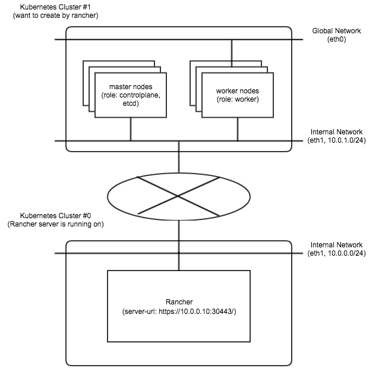

# cannot-register-nodes-in-multi-networked-environment

## Issue description

I'm trying to deploy new Kubernetes cluster from Rancher UI, on the environment like this.



- All of internal communication is done through ```Internal Network```.
  - between Rancher and Cluster #1
  - between master nodes and worker nodes
- Master nodes don't have a network interface connected to ```Global Network```. ```Global Network``` will be used for Kubernetes user Pods only.
- Rancher does not connect to new nodes/cluster directly but through the internal router.
  - Routing configuration is set as some static routes in each nodes.
- Nodes that does not have a interface connected ```Global Network``` cannot reach the Internet.
  - (But only in http(s), they can send requests for the Internet through a forward proxy)
  - They also does not have default gateway. 

In this environment, Rancher cannot complete new node registration.

According to error logs, I assume Rancher cannot handle new nodes in these environment, especially its IP address detection (defined as ```$CATTLE_ADDRESS```).
Logs are attached below.

## Environment

* Rancher v2.2.3
* On-prem hosts

## Step to reproduce

#### 1. Setup hosts as described above

#### 2. Add new cluster in Rancher UI
   - type: Custom
   - cluster options (as YAML)
```
addon_job_timeout: 30
authentication: 
  strategy: "x509|webhook"
bastion_host: 
  ssh_agent_auth: false
ignore_docker_version: true
ingress: 
  provider: "nginx"
kubernetes_version: "v1.13.5-rancher1-2"
monitoring: 
  provider: "metrics-server"
network: 
  flannel_network_provider: 
    iface: "eth1"
  options: 
    flannel_backend_type: "vxlan"
  plugin: "flannel"
restore: 
  restore: false
services: 
  etcd: 
    backup_config: 
      enabled: true
      interval_hours: 12
      retention: 6
    creation: "12h"
    extra_args: 
      election-timeout: "5000"
      heartbeat-interval: "500"
    retention: "72h"
    snapshot: false
  kube-api: 
    always_pull_images: false
    pod_security_policy: false
    service_cluster_ip_range: "10.234.0.0/16"
    service_node_port_range: "30000-32767"
  kube-controller: 
    service_cluster_ip_range: "10.234.0.0/16"
  kubelet: 
    cluster_dns_server: "10.234.0.10"
    fail_swap_on: false
  kubeproxy: 
    extra_args: 
      nodeport-addresses: "10.0.0.0/8"
ssh_agent_auth: false
docker_root_dir: "/var/lib/docker"
enable_cluster_alerting: false
enable_cluster_monitoring: false
enable_network_policy: false
local_cluster_auth_endpoint: 
  enabled: true
name: "test-cluster"
```

#### 3. Run Node Command in master nodes
In the next view (from step 2), 
   - role: controleplane, etcd
   - node address
     - public: each node's internal network address
     - internal: same as public

example of generated command:
```
sudo docker run -d --privileged --restart=unless-stopped --net=host -v /etc/kubernetes:/etc/kubernetes -v /var/run:/var/run rancher/rancher-agent:v2.2.3 --server https://10.0.0.10:30443 --token f4mk8zfk9lqn52696b75rklhskfkvtmlh8n7vcf692vd2vtxjkvkhv --ca-checksum 807d226ee53ea78446ab170fef4c369299009143cfa0b8b671ceb0eecb5e8a17 --address 10.0.1.10 --internal-address 10.0.1.10 --etcd --controlplane
```

#### 4. Confirm cannot register nodes
- In cluster dashboard, you can see some error messages about etcd plane like
```
[etcd] Failed to bring up Etcd Plane: [etcd] Etcd Cluster is not healthy
```

- Login each master node and check docker containers' status. 
```
admin@master0:~$ docker ps
CONTAINER ID                                                       IMAGE                                  COMMAND                                                                                                                                                                                                                                                                                                                                                                                                                                                                                                                                                                                                                                                                                                                                                                                                                                                                                                                                       CREATED             STATUS                         PORTS               NAMES
cfe1cc1421e6180756c1498fd928e515c97844b4c920b414edd6dbe61793834d   rancher/coreos-etcd:v3.2.24-rancher1   "/usr/local/bin/etcd --peer-client-cert-auth --client-cert-auth --listen-client-urls=https://0.0.0.0:2379 --initial-cluster=etcd-master0=https://10.0.1.10:2380,etcd-master1=https://10.0.1.11:2380 --trusted-ca-file=/etc/kubernetes/ssl/kube-ca.pem --key-file=/etc/kubernetes/ssl/kube-etcd-10-0-1-10-key.pem --name=etcd-master0 --initial-advertise-peer-urls=https://10.0.1.10:2380 --peer-cert-file=/etc/kubernetes/ssl/kube-etcd-10-0-1-10.pem --heartbeat-interval=500 --peer-key-file=/etc/kubernetes/ssl/kube-etcd-10-0-1-10-key.pem --initial-cluster-state=new --peer-trusted-ca-file=/etc/kubernetes/ssl/kube-ca.pem --cert-file=/etc/kubernetes/ssl/kube-etcd-10-0-1-10.pem --election-timeout=5000 --data-dir=/var/lib/rancher/etcd/ --initial-cluster-token=etcd-cluster-1 --advertise-client-urls=https://10.0.1.10:2379,https://10.0.1.10:4001 --listen-peer-urls=https://0.0.0.0:2380"   10 minutes ago      Up 10 minutes                                      etcd
05a326a63cfa606f0e6327adca202c7d1751793bee1beb63525c5e471cd7c65c   rancher/rancher-agent:v2.2.3           "run.sh --server https://10.0.0.10:30443 --token qjzrwct85vv9m2blnn2wbl8fqx6vlt2x2xzvhq4bxf4trvskrwbz79 --ca-checksum 807d226ee53ea78446ab170fef4c369299009143cfa0b8b671ceb0eecb5e8a17 --no-register --only-write-certs"                                                                                                                                                                                                                                                                                                                                                                                                                                                                                                                                                                                                                                                                                                                   11 minutes ago      Restarting (1) 4 minutes ago                       epic_raman
46ed79cc3b0fda11f361028b6de0356158410761d69c4f1eb25f74d26f54be35   rancher/rancher-agent:v2.2.3           "run.sh -- share-root.sh 'docker run -d --privileged --restart=unless-stopped --net=host -v /etc/kubernetes:/etc/kubernetes -v /var/run:/var/run rancher/rancher-agent:v2.2.3 --server https://10.0.0.10:30443 --token qjzrwct85vv9m2blnn2wbl8fqx6vlt2x2xzvhq4bxf4trvskrwbz79 --ca-checksum 807d226ee53ea78446ab170fef4c369299009143cfa0b8b671ceb0eecb5e8a17 --no-register --only-write-certs' /var/lib/kubelet /var/lib/rancher"                                                                                                                                                                                                                                                                                                                                                                                                                                                                                                          11 minutes ago      Up 11 minutes                                      share-mnt
6e453025978fc459757b9c6c2f0afc0f3c1a8090b34d682181e80a69a8407c4a   rancher/rancher-agent:v2.2.3           "run.sh --server https://10.0.0.10:30443 --token f4mk8zfk9lqn52696b75rklhskfkvtmlh8n7vcf692vd2vtxjkvkhv --ca-checksum 807d226ee53ea78446ab170fef4c369299009143cfa0b8b671ceb0eecb5e8a17 --address 10.0.1.10 --internal-address 10.0.1.10 --etcd --controlplane"                                                                                                                                                                                                                                                                                                                                                                                                                                                                                                                                                                                                                                                                             11 minutes ago      Up 11 minutes                                      inspiring_mestorf
```

In this example, the last (named ```inspiring_mestorf```) is a container launched in step 3. Second container named ```epic_raman``` is that not works because of ```CATTLE_ADDRESS``` auto-detection.

Check ```epic_raman``` 's log:

```
admin@master0:~$ docker logs epic_raman
INFO: Arguments: --server https://10.0.0.10:30443 --token REDACTED --ca-checksum 807d226ee53ea78446ab170fef4c369299009143cfa0b8b671ceb0eecb5e8a17 --no-register --only-write-certs
RTNETLINK answers: Network is unreachable
ERROR: -- --address is a required option
INFO: Arguments: --server https://10.0.0.10:30443 --token REDACTED --ca-checksum 807d226ee53ea78446ab170fef4c369299009143cfa0b8b671ceb0eecb5e8a17 --no-register --only-write-certs
RTNETLINK answers: Network is unreachable
ERROR: -- --address is a required option
INFO: Arguments: --server https://10.0.0.10:30443 --token REDACTED --ca-checksum 807d226ee53ea78446ab170fef4c369299009143cfa0b8b671ceb0eecb5e8a17 --no-register --only-write-certs
RTNETLINK answers: Network is unreachable
ERROR: -- --address is a required option
INFO: Arguments: --server https://10.0.0.10:30443 --token REDACTED --ca-checksum 807d226ee53ea78446ab170fef4c369299009143cfa0b8b671ceb0eecb5e8a17 --no-register --only-write-certs
RTNETLINK answers: Network is unreachable
ERROR: -- --address is a required option
INFO: Arguments: --server https://10.0.0.10:30443 --token REDACTED --ca-checksum 807d226ee53ea78446ab170fef4c369299009143cfa0b8b671ceb0eecb5e8a17 --no-register --only-write-certs
RTNETLINK answers: Network is unreachable
ERROR: -- --address is a required option
INFO: Arguments: --server https://10.0.0.10:30443 --token REDACTED --ca-checksum 807d226ee53ea78446ab170fef4c369299009143cfa0b8b671ceb0eecb5e8a17 --no-register --only-write-certs
RTNETLINK answers: Network is unreachable
ERROR: -- --address is a required option
INFO: Arguments: --server https://10.0.0.10:30443 --token REDACTED --ca-checksum 807d226ee53ea78446ab170fef4c369299009143cfa0b8b671ceb0eecb5e8a17 --no-register --only-write-certs
RTNETLINK answers: Network is unreachable
ERROR: -- --address is a required option
INFO: Arguments: --server https://10.0.0.10:30443 --token REDACTED --ca-checksum 807d226ee53ea78446ab170fef4c369299009143cfa0b8b671ceb0eecb5e8a17 --no-register --only-write-certs
RTNETLINK answers: Network is unreachable
ERROR: -- --address is a required option
```

This message is printed infinitely. 

I think ```epic_raman``` cannot write certificates used by etcd, so etcd plane is not start collectly.

## Proposal to fix this issue

**Most simple solution is pass ```--address``` / ```--internal-address``` option through the bootstrap container.**

The error preventing write-certs container running is caused at this line in rancher-agent's ```run.sh```.

https://github.com/rancher/rancher/blob/8bfb1af50a35ca9c071b9f8984b0a5c4ea325f90/package/run.sh#L165

In master nodes of my environment, rancher-agent cannot reach ```8.8.8.8``` and cannot decide ```$CATTLE_ADDRESS```.
So I set to the bootstrap container the option ```--address``` / ```--internal-address```. it follows setting ```$CATTLE_ADDRESS``` manually. It works.
But write-certs container launched by bootstrap container does not have these options.
